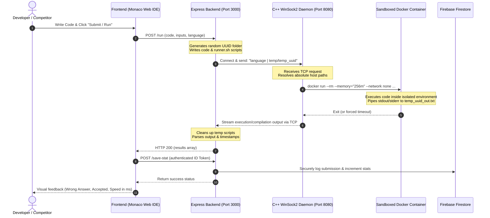

# 🚀 Production-Grade Secure RCE Sandbox & Competitive Programming Judge

An advanced, production-grade **Remote Code Execution (RCE) Sandbox & Competitive Programming Judge** designed to compile, execute, and validate user-submitted code under extreme security boundaries. The system features a native high-performance **C++ WinSock2 execution daemon**, containerized **Docker isolation**, an interactive **Monaco Editor IDE web portal**, and seamless automation integrated with the popular **Competitive Companion** browser extension.

Designed as a key piece of my software engineering portfolio, this project showcases full-stack expertise spanning low-level Windows systems programming, virtualization security, network protocols, modern frontend design, and scalable cloud architectures.

---

## 📸 Architecture & Execution Flow

The sequence diagram below details the end-to-end execution lifecycle. It tracks how untrusted code travels from the interactive Monaco Editor, through the Node.js Express server, down to the native C++ loopback TCP daemon, executes in an isolated Docker container, and records analytics back to Firebase Firestore.



---

## 🛠️ Key Technical Highlights & Architecture

This project is built around three core architectural pillars:

### 1. The Native C++ WinSock2 Daemon (`judge/judge.cpp`)
*   **High Performance socket server**: Built natively in C++ using the WinSock2 library (`ws2_32.lib`) to establish a zero-dependency loopback TCP socket connection on port `8080`.
*   **Decoupled Orchestration**: Avoids spawning expensive process wrappers directly in Node.js. Instead, the server forwards execution payloads (`language|temp_dir`) to the daemon, which acts as a lightweight hypervisor.
*   **Path Resolution & Management**: Handles Windows host-path mappings dynamically (mapping local project contexts using `%cd%`), mounts corresponding subdirectories, and executes cleanups immediately upon socket termination.

### 2. The Node.js Express Orchestrator (`server.js`)
*   **Cryptographic Isolation**: Generates a randomized workspace directory under `temp/temp_` using cryptographic UUIDs for every run request, guaranteeing that concurrent execution payloads never collide.
*   **Double-Layer Timeout Telemetry**: Measures precise execution intervals by executing high-precision milliseconds arithmetic within the shell container via Bash telemetry (`date +%s%3N`).
*   **Fail-Safe Cleanups**: Uses localized cleanup routines to purge workspace trails (`.cpp`, `.py`, `.sh`, input/output files) instantly post-run or through an absolute 10-second server fail-safe timer.
*   **Identity & State Management**: Integrates the **Firebase Admin SDK** to verify JWT tokens emitted by Google OAuth and issues transactions to record user profiles, submission history, and problem stats.

### 3. Interactive Glassmorphic Frontend Portal (`public/`)
*   **Monaco Editor Integration**: Integrates Microsoft's Monaco Editor featuring rich telemetry, dynamic font scaling, syntax highlighting, and responsive tab configurations.
*   **Visual Performance Tracker**: Shows a breakdown of compile errors, execution details, test case outputs, and real-time execution speeds in milliseconds.
*   **Glassmorphic Design System**: Uses a highly polished CSS design with interactive panel resize bars, variable layout modes (Normal execution vs. Competitive Problem Solver), and live custom theme overrides (Dracula, VS-Dark, Light, HC-Black).

---

## 🔒 Deep-Dive Security Sandboxing

Executing untrusted, user-submitted code is a high-risk operation susceptible to remote code execution (RCE) vulnerabilities. To defend the host environment, the C++ Daemon wraps all container runs with custom-enforced virtualization boundaries using **Docker engine restrictions**:

| Security Flag | Enforced Boundary | Vulnerability Mitigation |
| :--- | :--- | :--- |
| `--cpus="1"` | Pin container limit to a maximum of 1 CPU core | Mitigates infinite CPU loops or resource-exhaustion denial of service (DoS) attacks from dragging down the host machine. |
| `--memory="256m"` | Throttles RAM heap allocations to a maximum of 256MB | Prevents Out-Of-Memory (OOM) host-level crashes and memory exfiltration. |
| `--network none` | Completely severs inbound & outbound network access | Completely blocks reverse shells, port scanning, data exfiltration, or connections to external command-and-control servers. |
| `--pids-limit 64` | Restricts maximum concurrent sub-processes to 64 | Defends the host system against recursive process spawning exploits (Fork-Bombs). |
| `timeout 5s` | Shell-level command execution cap inside the container | Guarantees that hanging or stalled code will be killed immediately, freeing resources. |

---

## ⚡ Competitive Companion Integration

To streamline developer and competitor workflows, this project incorporates automatic problem seeding:
1.  **Custom Listener Protocol**: A dedicated Node.js Express microservice runs concurrently on Port `10043`.
2.  **Schema Interception**: When a competitive programmer clicks the green "plus" button on platforms like Codeforces, AtCoder, or CSES via the **Competitive Companion** browser extension, a POST payload containing test cases, execution time constraints, and metadata is caught by the listener.
3.  **Instant Workspace Mounting**: The server buffers the problem details locally, which are instantly pulled into the Monaco Editor workspace, populating test inputs and visual target expectations in real-time.

---

## 📂 Repository File Structure

```bash
rce-sandbox/
├── judge/                     # Native C++ Execution Daemon
│   ├── judge.cpp              # WinSock2 C++ Daemon source code
│   └── judge.exe              # Pre-compiled high-performance judge binary
├── public/                    # Frontend Glassmorphic UI Assets
│   ├── index.html             # Main IDE & Competitive Dashboard
│   ├── style.css              # Styling, Theme variables & Responsive structure
│   ├── api.js                 # AJAX network wrappers to back-end endpoints
│   ├── editor.js              # Monaco Editor configurations & hooks
│   ├── firebase.js            # Client-side Google Auth & Firestore client setup
│   ├── ui.js                  # DOM manager, modals, themes, panel resize controllers
│   └── script.js              # Application entry-point and state machine
├── temp/                      # Dynamic sandbox directory (Automated cleanups)
├── server.js                  # Node.js backend orchestrator & daemon lifecycle manager
├── serviceAccountKey.json     # Firebase Admin SDK Credentials (Not committed in production)
├── package.json               # Project manifest, scripts & dependencies
└── README.md                  # Detailed Documentation
```

---

## 🛠️ Quick Start & Setup Guide

Ensure the following prerequisites are installed before booting up the sandbox environment:
1.  **Docker Desktop** (Running and active on the host machine).
2.  **Node.js** (v18.0.0 or higher).
3.  **Windows OS** (Due to the native C++ daemon utilizing `winsock2.h`). *Note: To host this on Linux/macOS, modify the socket layers in `judge.cpp` to use BSD Unix sockets.*

### Step 1: Clone and Install
Clone the repository and install the Express dependencies:
```bash
git clone https://github.com/NivSha07/rce-sandbox.git
cd rce-sandbox
npm install
```

### Step 2: Pre-Pull Core Docker Images
Pull the compilers and interpreters ahead of time so the first submission executes instantly:
```bash
docker pull gcc:latest
docker pull python:latest
docker pull eclipse-temurin:latest
```

### Step 3: Configure Firebase Integration
Database caching and user submission statistics are driven by Firebase Firestore.
1. Create a Firebase project at the [Firebase Console](https://console.firebase.google.com/).
2. Head to your Firebase Auth settings and enable **Google Authentication**.
3. Initialize a **Cloud Firestore** Database.
4. Set up Web Client Configurations in `public/firebase.js`. Replace the configuration block with your project settings:
   ```javascript
   const fc = {
       apiKey: "YOUR_API_KEY",
       authDomain: "YOUR_PROJECT_ID.firebaseapp.com",
       projectId: "YOUR_PROJECT_ID",
       storageBucket: "YOUR_PROJECT_ID.firebasestorage.app",
       messagingSenderId: "YOUR_SENDER_ID",
       appId: "YOUR_APP_ID"
   };
   ```
5. Set up Admin credentials to authorize statistics tracking:
   * Navigate to **Project Settings** > **Service Accounts** inside the Firebase console.
   * Generate a new Private Key and save the downloaded file as `serviceAccountKey.json` directly in the root of the project directory.

### Step 4: Run the Sandboxed Judge
Start the primary server. Spawning the Node.js server automatically runs the C++ Judge Daemon (`judge.exe`) in the background:
```bash
node server.js
```
The server will successfully boot and bind to:
*   **Port 3000**: Main Web Application (`http://localhost:3000`)
*   **Port 10043**: Competitive Companion Webhook Listener

> [!TIP]
> If you modify the native backend daemon, compile it from source using GCC for Windows:
> `g++ judge/judge.cpp -o judge/judge.exe -lws2_32`

### Step 5: Install Competitive Companion Extension
1. Install **Competitive Companion** on your browser (Chrome/Firefox/Brave).
2. Go to the extension options and add `10043` to the list of Ports.
3. Open any problem on supported competitive programming platforms (e.g. Codeforces), click the green extension icon, and watch the problem sync to your Monaco workspace!

---

## 💼 Portfolio & Resume Showcase

This project was designed and built as a technical showcase for my software engineering resume/portfolio. It demonstrates strong competencies across:
*   **Low-Level Systems Programming**: Socket networking using WinSock2 API, binary compilation, and child process orchestration.
*   **Virtualization & Security**: Sandbox containment using Docker engines, PID limits, network blocking, and memory restrictions.
*   **Real-Time Backend Architecture**: Node.js, Express, multi-port listening, and high-precision Unix telemetry.
*   **Interactive Web Interfaces**: Monaco Editor, dynamic DOM structures, glassmorphic design, and adaptive dark mode engines.
*   **Cloud Operations**: Firebase token verification, Google OAuth authentication, and Firestore data indexing.

Feel free to explore the codebase, deploy it locally, or run experiments with execution boundaries!
