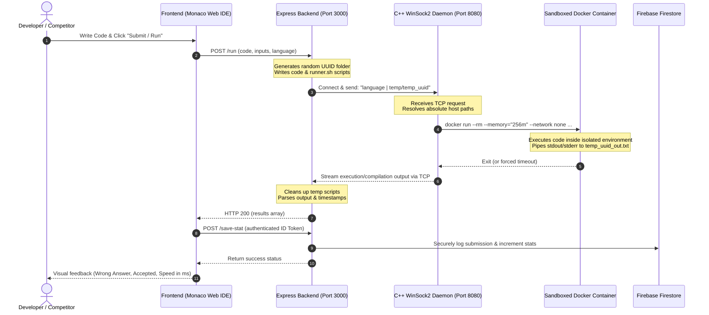

# 🚀 Secure RCE Sandbox & Competitive Programming Judge

A premium, production-grade **Remote Code Execution (RCE) Sandbox & Competitive Programming Judge** that allows developers and competitive programmers to compile, execute, and validate code safely. The project incorporates a lightweight C++ Winsock2 execution daemon, containerized Docker isolation, modular Monaco Editor web IDE, and seamless integration with the **Competitive Companion** browser extension.

---

## 📸 Architecture & Execution Flow

Below is the execution flow detailing how untrusted user code travels from the Monaco Editor frontend, through the Node.js Express server, gets isolated and monitored inside the native C++ TCP daemon, and finally runs within restricted Docker sandboxes.



---

## ✨ Core Features

### 🛡️ 1. Ultra-Secure RCE Sandbox
To safely compile and execute untrusted user-submitted code in **C++**, **Python**, and **Java**, the system utilizes customized Docker run-time sandboxes enforced with the following system boundaries:
*   **CPU Allocation Capping (`--cpus="1"`)**: Restricts each executed container to a maximum of one thread/core, shielding the host machine from CPU exhaustion loops.
*   **Memory Throttling (`--memory="256m"`)**: Strictly throttles heap allocations to 256MB to prevent out-of-memory (OOM) host crashes and memory leaks.
*   **Total Network Isolation (`--network none`)**: Disables all inbound and outbound networks inside the execution container, blocking reverse shells, network snooping, or data exfiltration.
*   **Process Limit Protection (`--pids-limit 64`)**: Defends the host system against malicious recursive fork-bombs by capping the total number of sub-processes to 64.
*   **Garbage-Collect Cleaners**: Automatically cleans up temporary files (`.cpp`, `.py`, `.java`, `.sh`, `.txt`, `.out`) immediately post-execution or after a fallback 10-second timeout.

### 🌐 2. Interactive Monaco Web IDE
*   **Interactive Editor Controls**: Fully interactive Monaco Editor workspace featuring syntax highlighting, live theme selectors (Dracula, VS-Dark, Light, HC-Black), and dynamic font resizing.
*   **Flexible Themes System**: Custom-engineered styling using modern vanilla CSS variables and local storage, letting users personalize the background and panel colors using color pickers.
*   **Problem Solver & Normal Modes**: Switch between **Normal Mode** (write raw scripts and execute them with custom inputs) and **Problem Viewer Mode** (load competitive problems, validate against test cases, and submit to the system).

### ⚡ 3. Competitive Companion Interceptor
*   **Automated Parsing**: Built-in Express handler running on Port `10043` that intercepts schema payloads sent by the **Competitive Companion** browser extension.
*   **Instant Sync**: As soon as you click the green "plus" button on Codeforces, AtCoder, or CSES, the backend catches the test cases, problem constraints, and name, auto-imports it into Firebase Firestore, and mounts it into the Monaco workspace instantly!

### 📊 4. Authenticated Profiles & Firestore Stats
*   **Secure Auth Integration**: Employs Firebase Auth Google Sign-in to authorize competitive programmers.
*   **Secure Statistics Backend**: When submitting to a problem, the server validates client identity via Google ID token verification and records metrics securely in Firestore, updating user statistics (`totalSubmissions`, `totalAccepted`, and `Success Rate`).

---

## 📂 Repository File Structure

```bash
rce-sandbox/
├── judge/                     # Native Judge Daemon Component
│   ├── judge.cpp              # WinSock2 C++ Daemon source code
│   └── judge.exe              # Pre-compiled high-performance judge binary
├── public/                    # Frontend Web Assets
│   ├── assets/                # Visual styles, SVGs, and images
│   ├── index.html             # Web-based Monaco IDE Dashboard
│   ├── style.css              # Glassmorphic Dark UI stylesheets
│   ├── api.js                 # Frontend AJAX HTTP helpers
│   ├── editor.js              # Monaco Editor hooks & configuration
│   ├── firebase.js            # Client-side Firebase configuration
│   ├── ui.js                  # Theme engine, layout managers & modals
│   └── script.js              # Application entry-point and state machine
├── temp/                      # Dynamic sandbox directory (Auto-cleaned)
├── server.js                  # Node.js backend server & daemon orchestrator
├── serviceAccountKey.json     # SECURE Firebase Admin cert (Not committed in prod)
├── package.json               # Package declarations and project metadata
└── README.md                  # Detailed Documentation
```

---

## 🛠️ Requirements & Setup

Before setting up the sandbox, make sure you have the following prerequisites installed on your system:

1.  **Docker Desktop** (Active and running on your host OS).
2.  **Node.js** (v18.0.0 or higher recommended).
3.  **Windows OS** (The judge compiler uses a WinSock2 TCP daemon, compiled into `judge.exe`). If deploying on Linux, rewrite `judge.cpp` using BSD Sockets.

### Step 1: Clone the Repository & Install Dependencies
```bash
git clone https://github.com/NivSha07/rce-sandbox.git
cd rce-sandbox
npm install
```

### Step 2: Establish the Sandbox Containers
Ensure Docker Desktop is active. The backend daemon relies on standard public Docker images for compiling and running the code. Pull the following images in advance:
```bash
docker pull gcc:latest
docker pull python:latest
docker pull eclipse-temurin:latest
```

### Step 3: Firebase Integration Config
The statistics logging and problem catalog require a Firebase project.
1. Create a Firebase project at the [Firebase Console](https://console.firebase.google.com/).
2. Enable **Google Authentication** in your Firebase Authentication settings.
3. Create a **Cloud Firestore** Database.
4. Set up Web Client Configurations in `public/firebase.js`:
   Replace the `fc` config object with your own Firebase Project details:
   ```javascript
   const fc = {
       apiKey: "YOUR_API_KEY",
       authDomain: "YOUR_PROJECT_ID.firebaseapp.com",
       projectId: "YOUR_PROJECT_ID",
       storageBucket: "YOUR_PROJECT_ID.firebasestorage.app",
       messagingSenderId: "YOUR_SENDER_ID",
       appId: "YOUR_APP_ID"
   };
   ```
5. Set up Admin SDK Credentials:
   * Go to **Project Settings** > **Service Accounts** inside your Firebase console.
   * Generate a new private key and save it as `serviceAccountKey.json` directly in the project root directory.

### Step 4: Run the Application
Start the Node.js Express server. Running the server automatically spawns the C++ TCP Judge Daemon (`judge.exe`) as a child process:
```bash
node server.js
```
The server will boot up and bind to two primary entry-points:
*   **Port 3000**: Main Web Application (`http://localhost:3000`)
*   **Port 10043**: Competitive Companion Listener

> [!NOTE]
> If the backend daemon requires recompilation, you can easily compile it using GCC for Windows:
> `g++ judge/judge.cpp -o judge/judge.exe -lws2_32`

### Step 5: Configure Competitive Companion Browser Extension
1. Install the **Competitive Companion** extension on Chrome, Firefox, or Brave.
2. Open the extension's settings page.
3. Under the "Ports" section, add `10043` to the list of ports.
4. Navigate to any competitive programming website (e.g. Codeforces), open a problem, and click the green extension button to instantly import it into your Sandbox IDE!

---

## 🔒 Security Throttles & Daemon Protocol

The communication between `server.js` and `judge.exe` takes place over a dedicated localhost TCP connection on port `8080`.

### Daemon Protocol Structure:
1. The Express server initiates a TCP socket connection to `127.0.0.1:8080`.
2. It sends the payload: `[language]|[temporary_directory_prefix]`.
   * *Example payload*: `cpp|temp/temp_e901a938-16e6-424a-85b9-1a5c4df1cbfa`
3. The C++ Daemon resolves the command execution and constructs a Docker execution shell command dynamically.
4. Inside Docker, a resource-capping flag acts as the execution wrapper:
   ```bash
   docker run --rm --memory="256m" --cpus="1" --network none --pids-limit 64 -v "%cd%":/usr/src/app -w /usr/src/app gcc:latest bash temp_uuid.sh
   ```
5. The container output is written directly to a temporary text file, read by `judge.exe`, and streamed back as a raw TCP string response to `server.js`.
6. Node.js cleans up all host filesystem logs, parses case boundaries (`---CASE0---`), compares execution timelines, and outputs final judge metrics.

---

## 🏆 Competitive Problem Catalog & seeding

On first boot, the system automatically verifies the Firestore `problems` collection. If it is empty, it seeds the collection with a standard starting problem:
*   **A. Array Prefix Sums**: Output an array of size `n` where the `i-th` element is the sum of integers from 1 to `i`.
*   Includes built-in test case metrics and hidden evaluation test cases to demonstrate runtime verification correctness.

---

## 🤝 Contribution & License
Contributions to reinforce sandboxing boundaries, support addition of runtime compilers (e.g. Rust, Go), or integrate UI enhancements are welcome.
This project is licensed under the **ISC License**. Feel free to fork, experiment, and integrate into your competitive environments!
